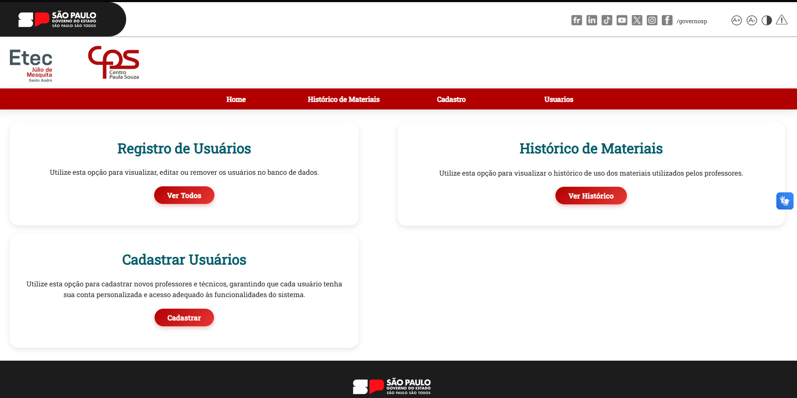

# 🔬 Sistema de Agendamento de Laboratórios - ETEC

<p align="center">
  
  
  
  
  
</p>

> **Projeto Interdisciplinar do 2º Semestre - Instituto Mauá de Tecnologia (IMT)**

Este sistema foi desenvolvido por alunos do **IMT** para a **ETEC**, com o objetivo de modernizar a gestão escolar. A aplicação web facilita o dia a dia da instituição permitindo o **agendamento de laboratórios por professores** e o **controle  de materiais e kits por técnicos e administradores**.

---

## ⚡ Funcionalidades Principais

O sistema conta com três perfis de acesso (Administrador, Técnico e Professor), oferecendo:

* ✅ **Gestão de Estoque:** Cadastro, edição e visualização de kits e materiais.
* 📅 **Agendamento:** Reserva de laboratórios de forma intuitiva para professores.
* 📊 **Controle Administrativo:** Visão geral de todos os recursos e usuários.
* 📱 **Responsividade:** Layout adaptável para computadores, tablets e smartphones.
* ♿ **Acessibilidade:** Integração completa com [VLibras](https://vlibras.gov.br/).
* 🌙 **Dark Mode** e **Aumentar e Diminuir Texto.**

---

## 🖼️ Demonstração Visual

###  Tela do Administrador


###  Tela do Técnico


###  Tela do Professor


---

## 🛠️ Tecnologias Utilizadas

O projeto foi construído utilizando uma arquitetura moderna e escalável:

**Front-end:**
* HTML5, CSS3
* JavaScript (Vanilla)

**Back-end:**
* **Node.js** (Ambiente de execução)
* **Express.js** (Gerenciamento de rotas e APIs)

**Ferramentas:**
* VSCode, Git e GitHub

---

## 🚀 Como Executar o Projeto

Para rodar o projeto localmente, você precisará ter o [Node.js](https://nodejs.org/) e o [Git](https://git-scm.com/) instalados.

### 1. Clone o repositório
```bash
git clone [https://github.com/EduardoManduca/ETEC.git](https://github.com/EduardoManduca/ETEC.git)
```

### 2. Instale as dependências
Acesse a pasta do projeto e instale os pacotes necessários:
```bash 
cd ETEC
npm install
```

### 3. Inicie o servidor
```bash
npm start
# Vai depender de cada configuração package.json

# padrão do projeto é: node index.js
```
Acesse a aplicação em: http://localhost:3000 (ou a porta definida no seu terminal)

## 👥 Equipe de Desenvolvimento
```markdown
Colaborador	                      GitHub
Bruno Zaca	                     @BrunoZaca

Eduardo Manduca	              @EduardoManduca

G. Tursi                          @gtursi07

Gustavo BR	                      @GustaBR

TouchBrownn	                     @TouchBrownn
```

-----

<p align="center"> Desenvolvido por alunos do Instituto Mauá de Tecnologia 💙 </p>