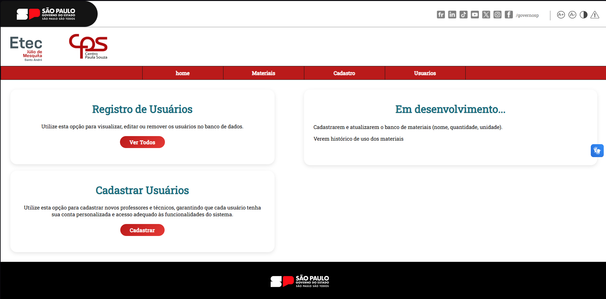
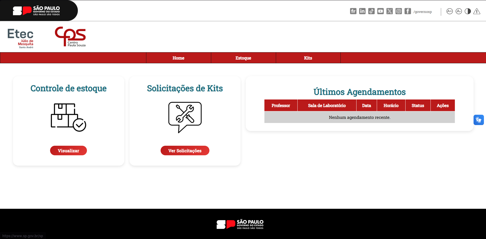
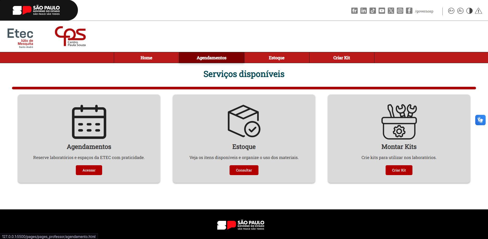

# ETEC 

## 🟢 Linguagens utilizadas

  
  
  

Projeto Interdisciplinar do Segundo Semestre do IMT, desenvolvido para a ETEC. O sistema permite o **agendamento de laboratórios por professores** e o **gerenciamento de materiais e kits por técnicos e administradores**.

---

## 👥 Equipe
- @BrunoZaca
- @EduardoManduca
- @gtursi07
- @GustaBR
- @TouchBrownn

---

## ⚡ Funcionalidades Principais
- Cadastro e gerenciamento de kits e materiais.
- Agendamento de laboratórios para professores.
- Controle de estoque de equipamentos e materiais.
- Responsividade completa para dispositivos móveis.
- Controle de acessibilidade via [VLibras](https://vlibras.gov.br/).
- Tema escuro (dark mode).

---

## 🖼️ Screenshots
### Tela do Administrador:

### Tela do Técnico:

### Tela do Professor:

---

## 🛠️ Tecnologias Utilizadas
- HTML5 / CSS3 / JavaScript
- Node.js (para servidor backend)
- Express.js (para rotas e APIs)
- Ferramentas: VSCode, Git, GitHub
---

